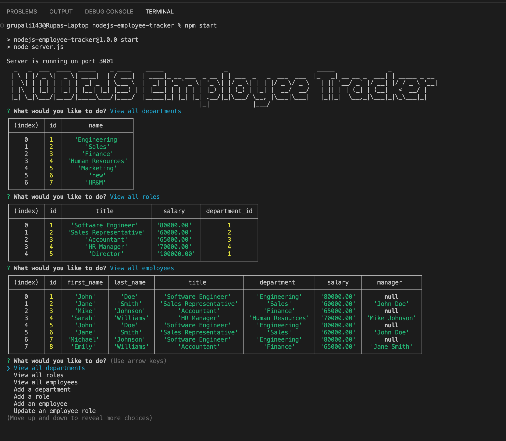

# nodejs-employee-tracker

  
## Description 

Challenge is to create interfaces that allow non-developers to easily view and interact with information stored in databases. These interfaces are called content management systems (CMS).
   

## User Story
AS A user, I want to be able to write and save notes

I WANT to be able to delete notes I've written before

SO THAT I can organize my thoughts and keep track of tasks I need to complete

## App working example
[Video Link](https://drive.google.com/file/d/1WFKr8Cew7IF_XivMCecyV-SwmJPqT6Wm/view)

## Table of contents

- [Description](#description)
- [Installation](#installation)
- [Usage](#usage)
- [license](#license)
- [Contributors](#contributors)
- [Tests](#tests)
- [Repository Link](#repository)
- [Questions](#questions)

## Installation
To install necesary dependencies, run the following command:

        npm i

## Usage

          node server.js

## license

## Contributors

https://github.com/rgadewar

## Tests
To run tests, run the following command:

          npm test

## Questions
If you have any questions about the repo, open an issue or contact me directly at email rupa@gadewar.com. You can find more of my work at
https://www.github.com/rgadewar

## Repository

- [Project Repo](https://github.com/rgadewar/nodejs-employee-tracker)
